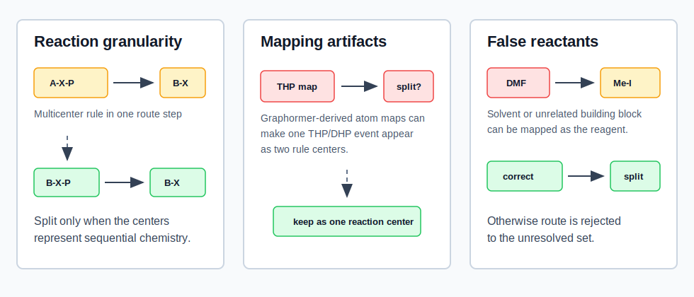

Preprocessing
=============

Manuscript Text
---------------

Before extracting route-level rules, we standardized the PaRoutes route trees
and curated reactions for which a single mapped route step did not correspond
to a chemically meaningful single transformation. Each route was normalized
with the route-inspector normalization utilities and each mapped reaction was
reanalyzed with SynPlanner rule extraction. Reactions assigned to multiple
single-center rules were then inspected for reaction granularity errors. When
the apparent multicenter event represented a legitimate sequence, the route
tree was reassembled into ordered one-step transformations while preserving the
original route identifier and PaRoutes JSON structure. For example, a forward
step of the form ``A-X-P -> B-X``, where conversion of ``A`` to ``B`` and
cleavage of protecting group ``P`` occurred in the same mapped reaction, was
rewritten as ``A-X-P -> B-X-P`` followed by ``B-X-P -> B-X``. Because the route
tree is retrosynthetic, this sequence was inserted in the reverse direction in
the route representation.

Three recurrent failure modes motivated this preprocessing step (Figure 1).
First, SynPlanner sometimes decomposed a single concerted or cascade
transformation into several local atom/bond changes, even though the chemistry
constituted one reaction center; these cases were retained as one step rather
than split. Second, Graphormer-derived atom mappings introduced artifacts,
especially for THP/DHP ether chemistry, where a single protection or
deprotection event could appear as a separate bond-forming step and an alkene
shift. Third, some routes contained false or irrelevant reactants, such as DMF
being mapped as a methylating reagent or unrelated building blocks appearing in
the reactant set. These reactions were corrected when an unambiguous reagent was
present, and otherwise were written to an unresolved set rather than propagated
into downstream rule extraction. Across the two PaRoutes subsets, preprocessing
identified 569 multicenter reactions, resolved 554 by route-tree reassembly,
and retained 15 unresolved routes for manual inspection (Table 1).

.. list-table:: Table 1. PaRoutes preprocessing outcome for reaction-granularity curation.
   :header-rows: 1
   :widths: 14 12 12 12 12 12 12 26

   * - Dataset
     - Routes
     - Modified routes
     - Multicenter reactions
     - Split reactions
     - Protection-related splits
     - Unresolved routes
     - Representative curation problems
   * - ``n1``
     - 10,000
     - 247
     - 255
     - 249
     - 87
     - 6
     - Reaction granularity, THP/DHP mapping artifacts, false methylating or coupling reagents
   * - ``n5``
     - 10,000
     - 301
     - 314
     - 305
     - 95
     - 9
     - Same issue classes observed independently in the larger route set
   * - Total
     - 20,000
     - 548
     - 569
     - 554
     - 182
     - 15
     - Corrected routes were retained; unresolved source-data errors were excluded from the cleaned route tree

   Figure 1. Route preprocessing distinguished chemically meaningful
   sequential transformations from artifacts of mapping or route extraction.
   Multicenter reactions were split only when they corresponded to ordered
   one-step chemistry; apparent multicenter events caused by local cascades,
   Graphormer mapping artifacts, or unsupported false reactants were retained
   as one center or moved to the unresolved set.

Reproducibility
---------------

The cleaned datasets and preprocessing reports were generated with:

.. code-block:: bash

   python -m route_inspector.cli preprocess-routes \
     --input-dir data/raw \
     --output-dir data/clean \
     --summary-dir outputs \
     --datasets n1_routes.json n5_routes.json \
     --config configs/rule_extraction_functional_groups.yaml \
     --ignore-errors

The command writes cleaned route JSON files under ``data/clean`` and
dataset-specific preprocessing reports under ``outputs/<dataset>/00_preprocess``.
